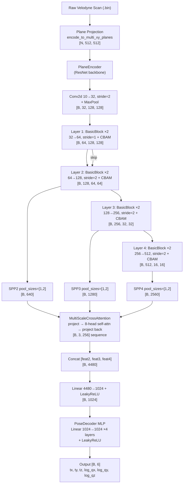
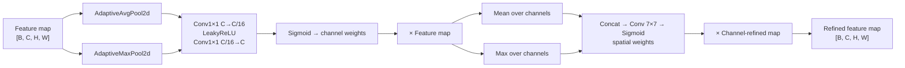
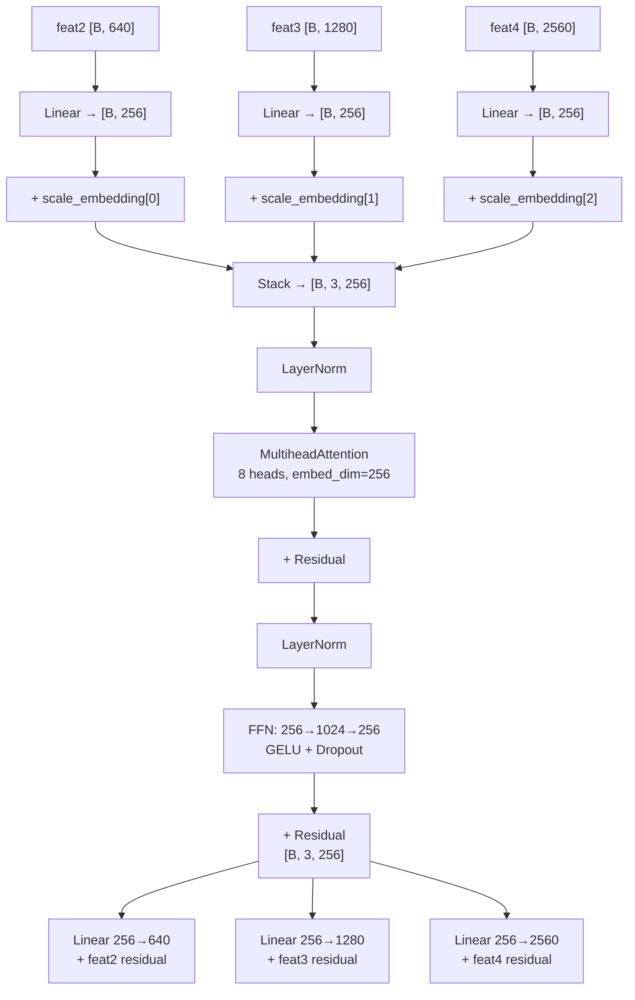

# PlaneLocNet — 6DOF Absolute Pose Regression from LiDAR

A deep learning pipeline for **6-DOF LiDAR localization** using absolute pose regression. Raw Velodyne point clouds are encoded into multi-channel bird's-eye-view plane projections and fed into a ResNet-based encoder with CBAM attention and multi-scale cross-attention, producing a direct translation + log-quaternion pose estimate.

Trained and evaluated on the [NCLT Dataset](http://robots.engin.umich.edu/nclt/) on a single **NVIDIA RTX 5070 Ti**.

---

## Table of Contents

- [Overview](#overview)
- [Architecture](#architecture)
- [Project Structure](#project-structure)
- [Installation](#installation)
- [Dataset Setup](#dataset-setup)
- [Configuration](#configuration)
- [Training](#training)
- [Inference & Testing](#inference--testing)
- [Pose Representation](#pose-representation)
- [Loss Function](#loss-function)
- [Hardware](#hardware)

---

## Overview

Most LiDAR localization methods rely on map matching, ICP, or relative odometry. This project takes a different approach — **absolute pose regression** — where a neural network directly maps a single LiDAR scan to its 6DOF pose in a global coordinate frame.

The key design choices are:

- **Plane projection encoding**: instead of raw point clouds or voxel grids, each scan is encoded into `N` horizontal Z-slabs (bird's-eye-view depth images), one per altitude band. This gives a structured 2D multi-channel input that standard CNNs can process efficiently.
- **Multi-scale ResNet encoder**: features are extracted at three spatial scales (after layers 2, 3, 4) and combined via Spatial Pyramid Pooling.
- **CBAM attention at every layer**: channel and spatial attention refines features at each resolution.
- **Cross-scale attention**: a transformer-style self-attention module lets the three SPP feature vectors communicate before concatenation, so fine-grained and coarse-grained features can mutually inform each other.
- **Log-quaternion pose output**: rotation is represented as a 3D log-quaternion (the logarithmic map of a unit quaternion), which is unconstrained and easier to regress than raw quaternions.

---

## Architecture

### Full pipeline



### CBAM attention block



### Multi-scale cross-attention



---

## Project Structure

```
.
├── config_files/
│   └── config.json                  # Training configuration
├── data_loaders/
│   ├── dataloader_nclt_logq.py      # NCLT dataset, dataloader, collate function
│   └── planeProjection.py           # Point cloud → multi-plane BEV encoding
├── src/
│   ├── model.py                     # PlaneLocalizationNet, PlaneEncoder, PoseDecoder
│   └── model_CBAM.py                # ChannelAttention, SpatialAttention, CBAM
├── pose_util.py                     # Pose math utilities (qlog, qexp, interpolation)
├── utils.py                         # Loss functions, checkpoint save/load
├── train.py                         # Training script with Trainer class
├── test.py                          # Inference and evaluation script
└── outputs/                         # Checkpoints, logs, gradient stats (auto-created)
```

---

## Installation

**Python 3.9+** is recommended.

```bash
git clone https://github.com/yourusername/plane-locnet.git
cd plane-locnet
pip install -r requirements.txt
```

### `requirements.txt`

```
torch>=2.1.0
torchvision>=0.16.0
numpy>=1.24.0
scipy>=1.11.0
pandas>=2.0.0
h5py>=3.9.0
open3d>=0.18.0
transforms3d>=0.4.1
tqdm>=4.66.0
tensorboard>=2.15.0
matplotlib>=3.8.0
```

> **CUDA**: The code auto-detects GPU. Install the CUDA-compatible PyTorch build from [pytorch.org](https://pytorch.org/get-started/locally/) matching your driver version before running `pip install -r requirements.txt`.

---

## Dataset Setup

Download the [NCLT dataset](http://robots.engin.umich.edu/nclt/). You need for each sequence:

- `velodyne_left/` — directory of `.bin` Velodyne scan files, each named by microsecond timestamp (e.g. `1328191273133282.bin`)
- `groundtruth_<sequence>.csv` — ground truth poses

Expected directory layout:

```
/path/to/NCLT/
├── 2012-01-22/
│   ├── velodyne_left/
│   │   ├── 1327194947760316.bin
│   │   └── ...
│   └── groundtruth_2012-01-22.csv
├── 2012-02-02/
│   └── ...
└── NCLT_pose_stats.txt              # auto-generated on first training run
```

Set `nclt_root` in `config.json` to the root of this directory.

---

## Configuration

All training and model settings live in `config_files/config.json`.

```json
{
  "data": {
    "dataset_type": "nclt",
    "nclt_root": "/path/to/NCLT",
    "train_sequences": ["2012-02-18", "2012-02-02", "2012-05-11", "2012-01-22"],
    "val_sequences":   ["2012-03-31"],
    "bounds_zyx":      [-11, 1, -55, 60, -40, 40],
    "num_planes":      10,
    "grid_size":       512,
    "max_points_per_cloud": 30000
  },
  "model": {
    "num_planes":        10,
    "grid_size":         512,
    "feature_dim":       1024,
    "hidden_dim":        1024,
    "block_type":        "basic",
    "dropout_rate":      0.1,
    "num_layers":        4,
    "use_cbam":          true,
    "use_cross_attention": true,
    "cross_attn_dim":    256,
    "cross_attn_heads":  8
  },
  "training": {
    "num_epochs":       100,
    "batch_size":       24,
    "learning_rate":    0.00025,
    "weight_decay":     1e-6,
    "grad_clip":        10.0,
    "num_workers":      6,
    "use_augmentation": false,
    "log_interval":     1000,
    "output_dir":       "./outputs",
    "resume_from":      "",
    "early_stopping":   10,
    "lr_decay_factor":  0.99,
    "lr_step_size":     1,
    "learn_beta":       true,
    "atloc_sax":        0.0,
    "atloc_saq":        -3.0,
    "loss_type":        "l1"
  }
}
```

| Key | Description |
|---|---|
| `bounds_zyx` | `[z_min, z_max, y_min, y_max, x_min, x_max]` — spatial crop of point cloud |
| `num_planes` | Number of horizontal Z-slabs for plane projection |
| `grid_size` | Spatial resolution of each plane (pixels × pixels) |
| `block_type` | `"basic"` (BasicBlock) or `"bottleneck"` (BottleneckBlock) |
| `learn_beta` | If `true`, loss weighting parameters `sax`/`saq` are learned automatically |
| `atloc_saq` | Initial log-scale weight for rotation loss (more negative = higher rotation weight) |

---

## Training

```bash
python train.py --config config_files/config.json
```

Resume from a checkpoint:

```bash
python train.py --config config_files/config.json --resume outputs/checkpoint_epoch_50.pth
```

Training outputs (written to `output_dir`):

| File / Directory | Contents |
|---|---|
| `checkpoint_epoch_N.pth` | Full checkpoint every epoch (model, optimizer, scheduler, config) |
| `best_model.pth` | Checkpoint with lowest validation loss |
| `logs/` | TensorBoard event files |
| `gradient_stats.txt` | Per-layer gradient norms logged every `log_interval` batches |
| `NCLT_pose_stats.txt` | Translation mean/std computed from training sequences (used to normalize poses) |

Monitor training with TensorBoard:

```bash
tensorboard --logdir outputs/logs
```

### What the training loop does

1. Encodes each scan to a `[10, 512, 512]` plane tensor on-the-fly per worker.
2. Runs a forward pass through `PlaneLocalizationNet`.
3. Computes `AtLocCriterion` loss (learnable-weighted L1 on translation + log-quaternion).
4. Clips gradients at norm 10, then steps Adam.
5. Decays LR by 0.99 every epoch (StepLR).
6. Validates every 5 epochs; saves best checkpoint.

---

## Inference & Testing

```bash
python test.py --checkpoint outputs/best_model.pth
```

The checkpoint config is read automatically (sequences, `num_planes`, `grid_size`, `nclt_root`). You can override:

```bash
python test.py \
  --checkpoint outputs/best_model.pth \
  --sequences 2012-03-31 \
  --output results_val.txt \
  --batch_size 24
```

Results are written to the output `.txt` file with:

- Per-frame translation error (in normalized coordinate space)
- Per-frame rotation error (degrees), computed via `2 * arccos(|q1 · q2|)`
- Predicted and ground-truth translation vectors and quaternions
- Summary statistics (mean, median, min, max, std)

> **Note on units**: Translation errors are in the normalized coordinate space (mean-subtracted training distribution). Multiply by the `std_t` values printed at test time to recover metric errors.

---

## Pose Representation

Poses are stored and predicted as **6D vectors**:

```
[tx, ty, tz,  log_qx, log_qy, log_qz]
```

- `tx, ty, tz` — translation, mean-subtracted using training set statistics
- `log_qx, log_qy, log_qz` — logarithmic map of the unit quaternion:

```
qlog(q) = arccos(q_w) * [q_x, q_y, q_z] / ||[q_x, q_y, q_z]||
```

To recover a unit quaternion from a log-quaternion vector `v`:

```
qexp(v): n = ||v||,  q = [cos(n),  sinc(n/π) * v]
```

This representation is unconstrained (no unit-norm constraint to enforce during training) and has better-behaved gradients than raw quaternions near the identity rotation.

---

## Loss Function

The **AtLoc criterion** with learnable uncertainty weighting:

```
L = exp(-sax) * L1(pred_t, gt_t)  +  sax
  + exp(-saq) * L1(pred_q, gt_q)  +  saq
```

Where `sax` and `saq` are learnable scalar parameters (log-uncertainty). This is the homoscedastic uncertainty weighting from Kendall & Cipolla (2017). With `learn_beta: true`, the network automatically finds the right balance between translation and rotation supervision without manual tuning of a fixed weight.

Initial values: `sax = 0.0`, `saq = -3.0` (giving roughly 20× higher weight to rotation at the start of training).

---

## Hardware

Trained on a single **NVIDIA RTX 5070 Ti** (16 GB VRAM).

- Batch size: 24
- `num_planes`: 10, `grid_size`: 512
- `max_points_per_cloud`: 30,000 (for point cloud collation)
- `num_workers`: 6

On smaller GPUs, reduce `batch_size` or `grid_size` accordingly. Setting `max_points_per_cloud` lower (e.g. 15,000) can also help if the point cloud collation causes memory pressure.

---

## Acknowledgements

- Pose utility functions and NCLT data pipeline adapted from [SGLoc](https://github.com/liw95/SGLoc) (Wen et al., CVPR 2023).
- AtLoc loss formulation from [AtLoc](https://github.com/BingCS/AtLoc) (Wang et al., AAAI 2020).
- CBAM from [CBAM: Convolutional Block Attention Module](https://github.com/Jongchan/attention-module) (Woo et al., ECCV 2018).
- [NCLT Dataset](https://robots.engin.umich.edu/nclt/) — Carlevaris-Bianco et al., IJRR 2016.